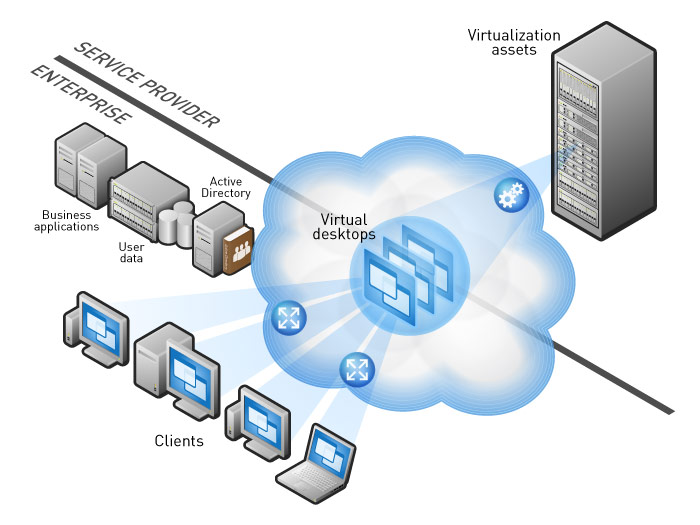
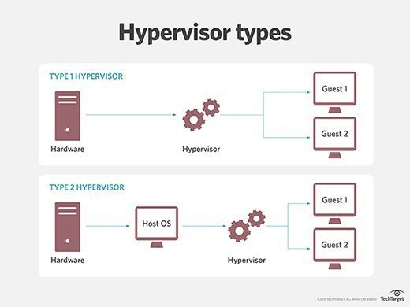
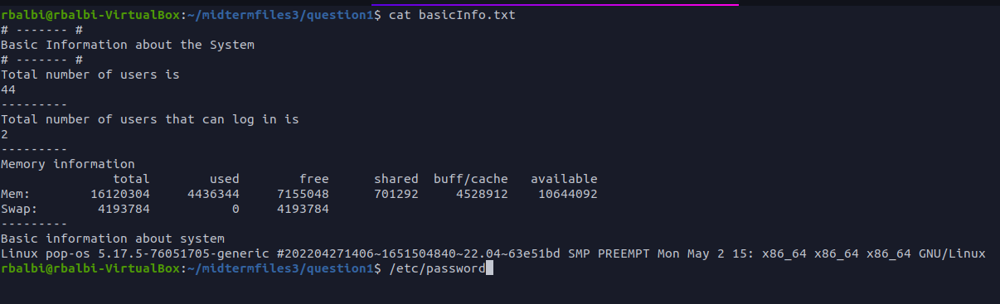

## What is Virtualization?
Definition:Virtualization uses software to create an indirection over computer hardware. It allows the hardware elements of a single computer, memory, storage and more—to be divided into multiple virtual machine
### Types of virtualization
* **server-side virtualization:** def: is the process of dividing a physical server into multiple unique and isolated virtual servers by means of a software application. Each virtual server can run its own operating systems independently.
  pic 

* **client-side virtualization:** def:is a virtual machine environment in the user's machine. Also called endpoint virtualization the user's computer hosts multiple VMs, each of which contains an operating system and set of applications.
 pic )
### Hypervisor
definition-a program used to run and manage one or more virtual machines on a computer.
### Types of hypervisor 
* type 1 def-Type 1 runs on bare metal generally one without any software (OS or applications).
* type 2 def- Type 2 runs on top of an operating system.

## Virtualbox

def:VirtualBox is designed to run another computer on your computer without reinstalling your OS that is running on a physical machine. One more VirtualBox advantage is that this product can be installed for free. A virtual machine (VM) works much like a physical one.
 
### How to create virtual machine
* Launch VMware Workstation.
* Click New Virtual Machine.
* Select the type of virtual machine you want to create and click Next
* Enter your Product Key.
* Create a user name and password.
* Click Next.
* Enter a virtual machine name and specify a location for virtual machine files to be saved, 
* Establish the virtual machine's disk size, select whether to store the virtual disk as a single file or split the virtual disk into 2GB files

## Installing ubuntu server in virtualbox
*  install ubuntu software
  `sudo apt install + package name`
*  example `sudo apt install vlc` install vlc package
* Deleting  software
 `sudo apt remove + package name` 
  * example `sudo apt remove vlc` remove vlc package
* searching for software
Open your Terminal via the keyboard combination Ctrl + Alt + T. 
`sudo apt-cache search [application name or type]`
  * example `sudo apt- cache search tetris`
  
### Updating Ubuntu 
Open the terminal application
For remote server use the ssh command to login. For example:
ssh user@server-name)
Fetch update software list by running the sudo apt-get update
### Installing Software in Ubuntu 
`sudo apt install ubuntu`

## Basics Linux commands
* ls example long list 
* pwd command :used for displaying the current working directory
* cd command : used for changing the current directory
* tree command : display the content of a directory in a tree-like format.

### Navigating the filesystem
cd command takes you from your home directory and go to an other 
Example cd / home directory
## Managing files and directories 
#### mkdir 
* description :  create directories
* usage `mkdir + option+ new directory`
* create parent and child directory
* mkdir -p dog/cat 
