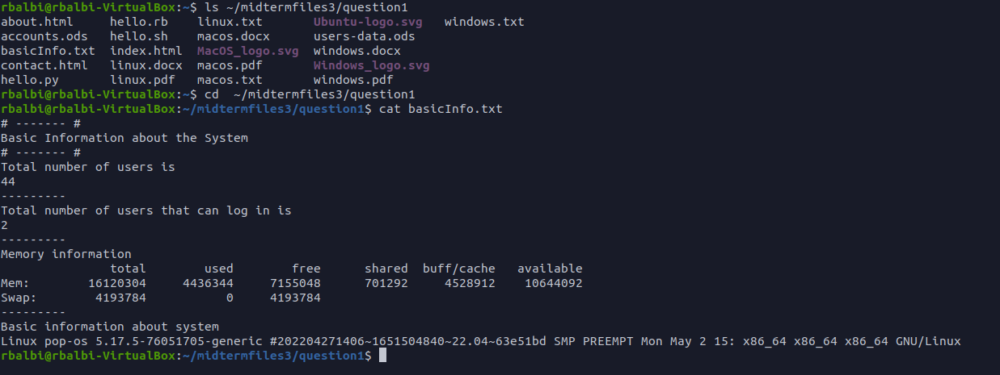

# Deliverable 1

## Project description
    
## Project hardware and software requirements
* visual machine
## What is Linux?
* Linux is a family of open-source Unix-like operating systems based on the Linux kernel
### Short history of linux

### Linux distribution

Slackaware: is used for design stability and simplicity and to be the most "Unix-like" Linux distribution
Debian: is a GNU/Linux distribution composed of free and open-source software, developed by the community-supported Debian
Ubuntu:
Kali Linux:
Red Hat Enterprise Linux:
Fedora:
        
## Open Source VS Closed Source

## The Free software movement
