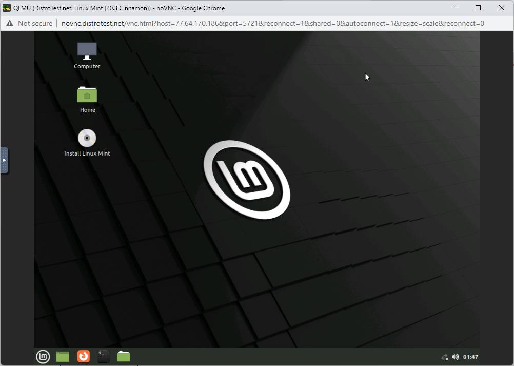
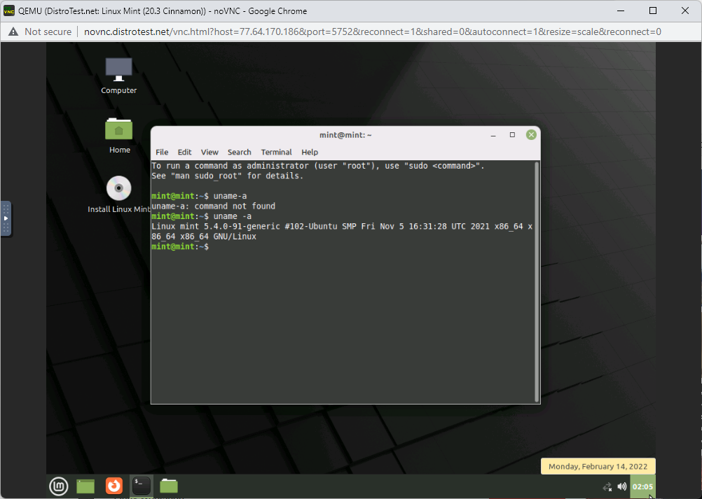
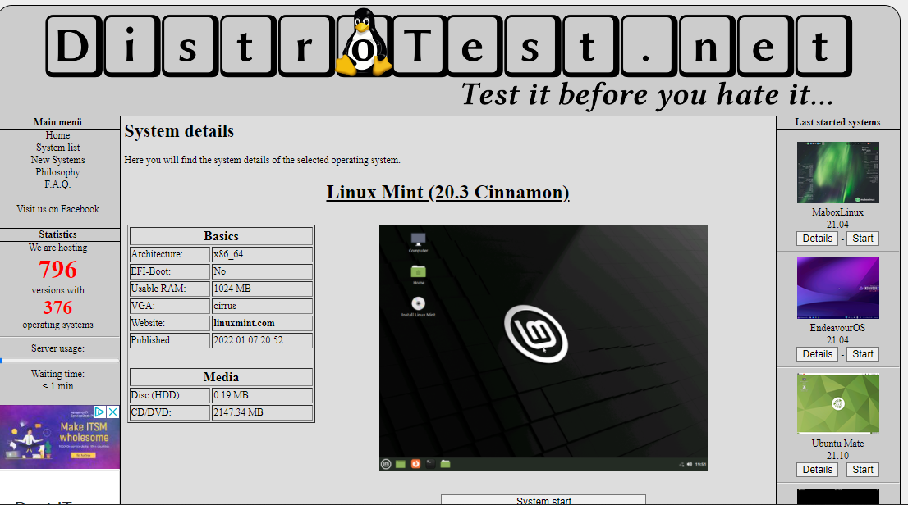

# Lab 1 Exploring Linux Distributions

## Question 1
1. What is the OS Type:  **Linux** 
2. Which major distro is it based on? **Debian**
3. Which processor architecture does it support?  **armhf, ppc64el, riscv, s390x, x86_64**              
4. Is the distribution active or is it discontinued? **Active**
5. What is the distro’s home page? **https://www.ubuntu.com/**

## Question 2
1. What is the name of the distribution and the OS Type: **Linux** 	**T2 System Development Environment**
2. Which major distro is it based on?  **ROCK**
3. Which processor architecture does it support?
 **arm64, armel, ia64, mipsel, mips64, m68k, powerpc, powerpc64, riscv64, sparc64, x86, x86_64**
4. Is the distribution active or is it discontinued? **Active**
5. What is the distro’s home page? **http://www.t2-project.org/**

## Question 3 
What is the name of the distribution? **MX Linux**
What is the country of Origin? **Greece**
What major distribution is it based on? **Debian (Stable), antiX**
What is the distribution category? **Desktop, From RAM, Live Medium, Raspberry Pi** 
Which processor architecture, aside from the one in the original query, does the OS support?
**: armhf, i686, x86_64**
## Question 4
### A Linux distribution used for Data Rescue/Data recovery

| Distro name |           Website                      | Desktop Environment |
|-------------|----------------------------------------|---------------------|
| Rescatux    | http://www.supergrubdisk.org/rescatux/ | LXQt                |

### A Linux distribution used for Education that supports the ix86 processor architecture.

| Distro name           | Website                    | Desktop Environment                |
|-----------------------|----------------------------|------------------------------------|
| Debian Edu/Skolelinux | http://www.skolelinux.org/ | GNOME, KDE, LXDE, LXQt, MATE, Xfce |
### A Linux distribution that supports the OEM installation method 
| Distro name | Website                | Desktop Environment  |
|-------------|------------------------|----------------------|
| Linux Mint  | https://linuxmint.com/ | Cinnamon, MATE, Xfce |
## Question 5 

## Question 6

