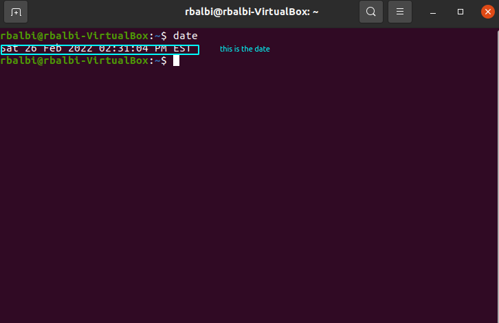
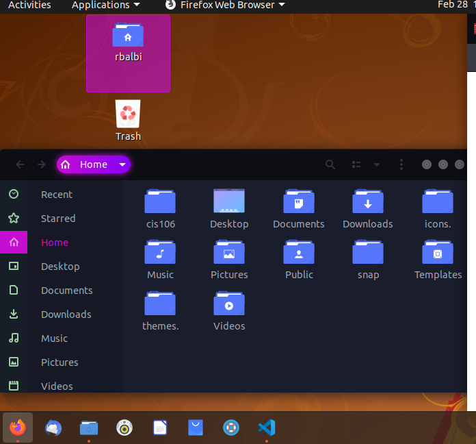
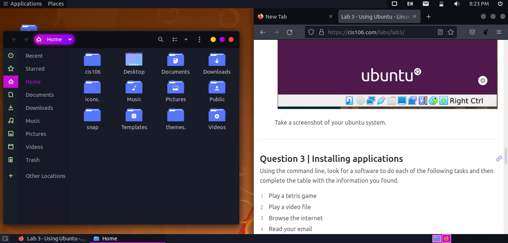

# Lab 3 Using Ubuntu

# Question 1
 

# Question 2

# Question 3

| Program purpose     | Package Name | Version   | Description |
| ------------------- | ------------ | --------- | ------------|
| Play a tetris game  | quadrapassel | 1:3.36.0-1| tetris game |
| Play a video file   | youtube      | 20200324-1| video download from youtube and other sites|
| Browse the internet | w3m          | 0.5.3-37  | image extension|
| Read your email     | rain loop    | 1.12.1-2  |  Simple, modern & fast web-based email client|
| Play music          | yt           | 2022.02.04-1|video downloader|

commands Answers:
* Sub question 1:`` sudo apt install quadrapassel youtube w3m rain loop yt -y
* Sub question 2:`` sudo apt remove  quadrapassel youtube w3m rain loop yt -y
* Sub question 3:`` sudo apt install/remove  quadrapassel+ youtube+ w3m- rain loop- yt- 
  
  # Question 4
  | command | what it does |
  |---------|--------------|
  | echo    | display a line of text|
  | fortune | print a random, hopefully interesting, adage|
  | cowsay  | configurable speaking/thinking cow (and a bit more)|
  | lolcat  | rainbow coloring for text|
  | figlet  | display large characters made up of ordinary screen characters|
  | toilet  | display large colourful characters|
  | rig     | Random Identity Generator|
         