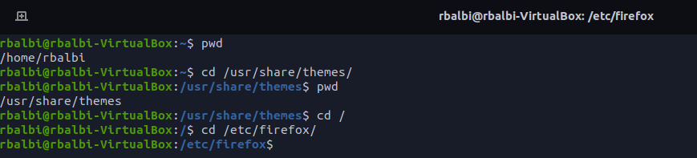
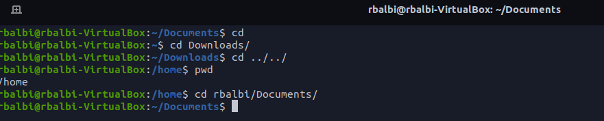
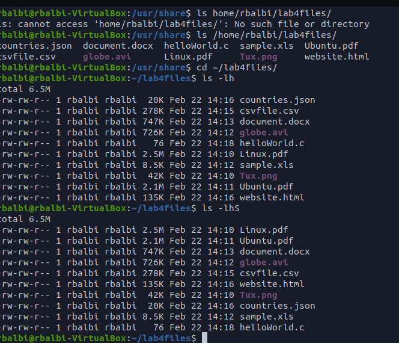
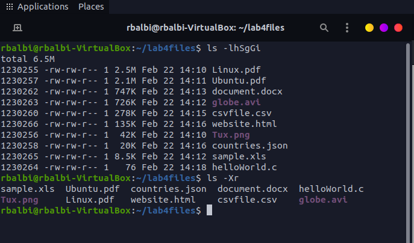
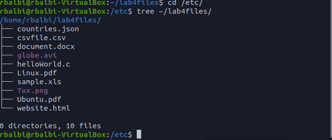
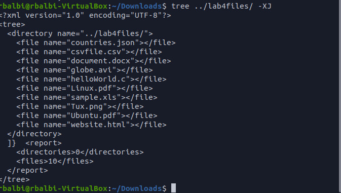
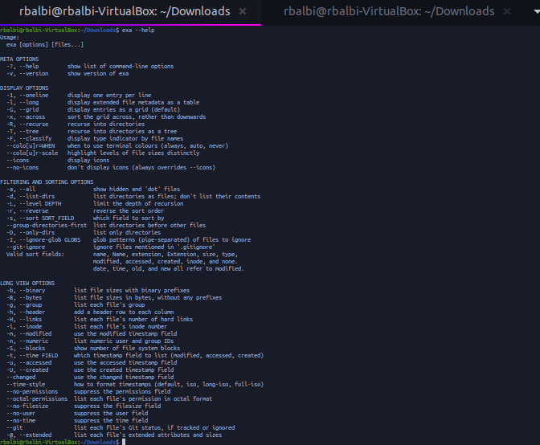
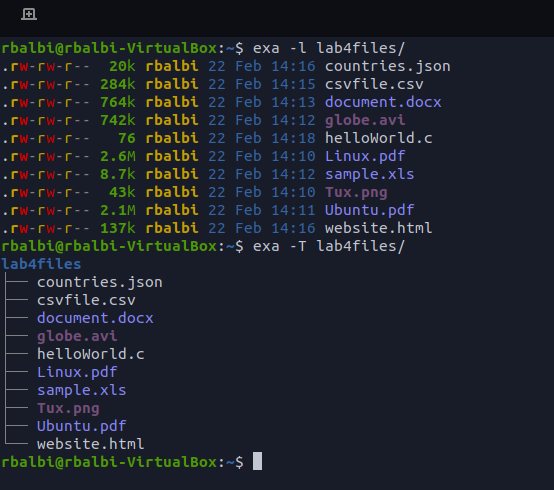
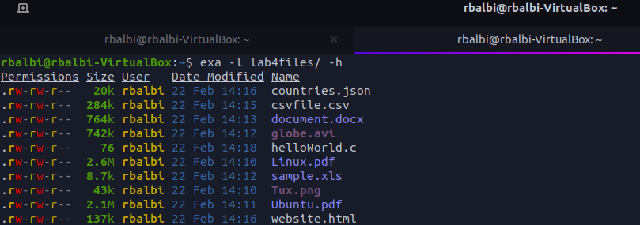

# lab 4
## question 1

| Directory | Function                                                       |
| --------- | -------------------------------------------------------------- |
| bin       | essential commands                                             |
| dev       | device files                                                   |
| etc       | system configuration files                                     |
| home      | user home directories                                          |
| media     | mount point                                                    |
| opt       | add-on software packages                                       |
| proc      | kernel information,process control,system hardware information |
| srv       | info relating to service                                       |
| usr       | software not essential                                         |
| var       | dedicated to variable data                                     |

## table 2

| command | description               | syntax | example                                 |
| ------- | ------------------------- | ------ | --------------------------------------- |
| cd      | change directory          | cd ~   | cd ../                                  |
| pwd     | current directory         | pwd    | pwd                                     |
| ls      | list content of directory | ls -a  | list all files inside a given directory |

## question 2 
* pwd command :used for displaying the current working directory
* cd command : used for changing the current directory

## question 3 

## question 4

## question 5

