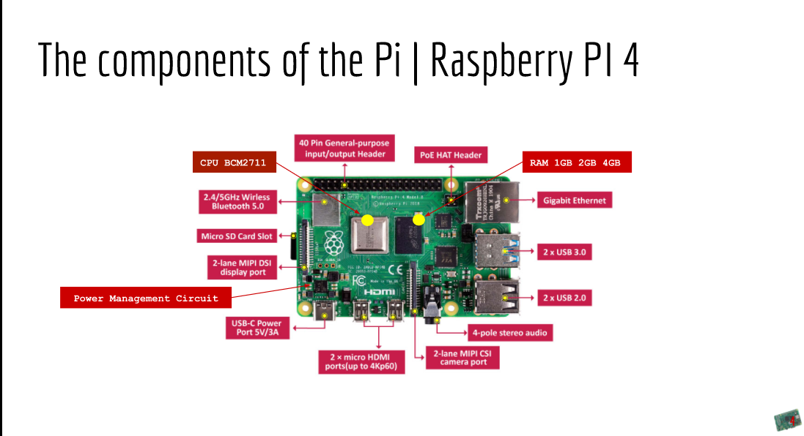

# Week Report 2
## Summary of Presentations
What is Raspberry Pi?
**The Raspberry Pi is a low cost,credit-card sized computer that plugs in to a computer monitor or TV, and uses a standard keyboard and mouse.**
  Make a bulleted listed of 5 projects you can do with a raspberry pi?
* Set Up a Retro Gaming Machine. 
* Build a Minecraft Game Server.
* Control a Robot.
* Build a Stop Motion Camera.
* Replace Your Desktop PC With a Raspberry Pi
